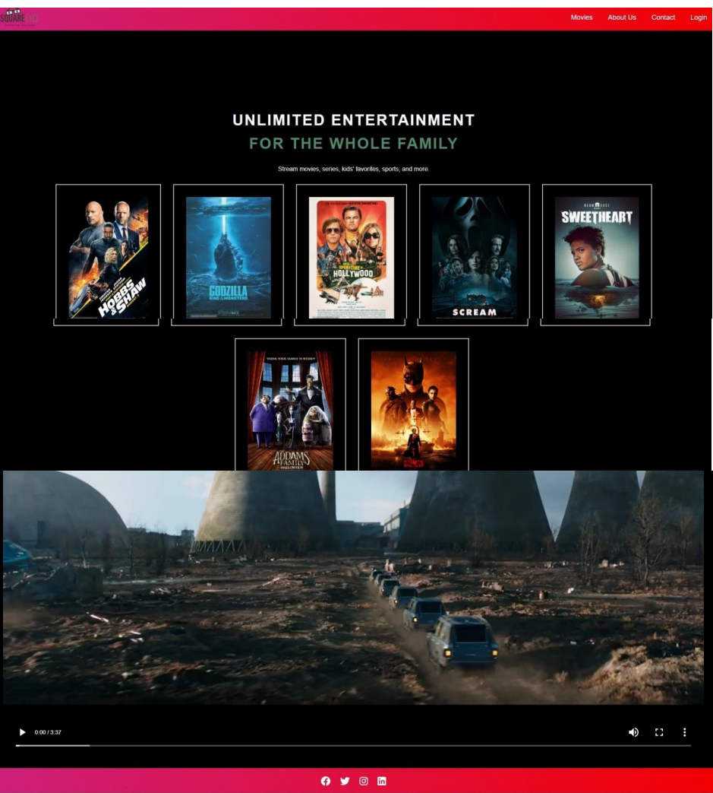

**Squereeyes**


*Square Eyes is a cross course project that I made during my first year at Noroff. It's a fictional website for movie directors and watchers, showing the account for movie watchers only. There are still several changes and improvements needed, as it's mostly built using HTML and CSS with some JavaScript.*


**DESCRIPTION**
Welcome to our video streaming platform, where film enthusiasts can directly buy and enjoy high-quality movies from the creators themselves. Aimed at movie lovers aged 25 to 40, our site makes it easy to find and explore a wide range of films across various genres.

Our slogan, "Connecting Film-Lovers," captures our mission to bring together a community of viewers and filmmakers. Here, you can quickly purchase and stream your next favorite film, supporting the creators directly.

Our user-friendly website highlights the latest and most popular films, offering personalized suggestions to help you discover new cinematic treasures. Whether you're after an indie film, a touching documentary, or a critically acclaimed hit, we're your one-stop-shop for great cinema.

Join us on a journey through captivating stories and unique visions from around the world, all from the comfort of your home.

Site architecture:
___

- Movies

- About us 

- Contact

- Login

  


**Build with:**
___

- HTML

- CSS

- JAVASCRIPT
  
 
**Getting Started**
___ 

**Installing**

1.Clone the repo:
```bash
 git clone git@github.com:TGBAKC/SQUAREYES.git
```
2.Install the depencies:
```bash
npm install
```

**Running**

To run the app, run the following commands:

```bash
npm run start
```
**Contributing**

If you would like to contribute to my project - Just make a pull request and push your changes.

**Contact**
